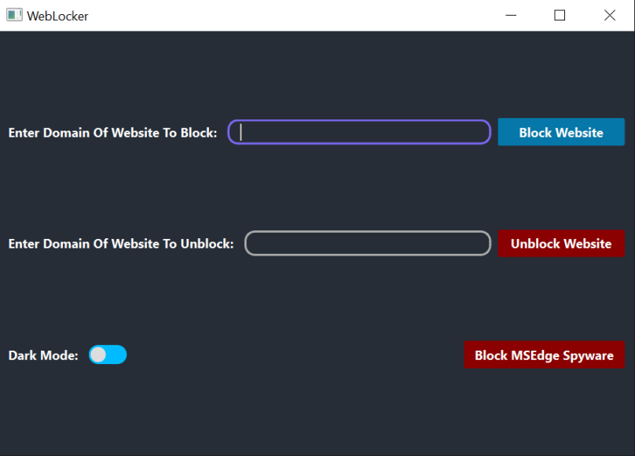

# WebLock
WebLock is a website blocker [WebLocker].

### More Information about WebLock: https://github.com/Gavriel770U/WebLock/wiki 

________________________________________________________________

# Note Before Using
WebLocker requires administrator / sudo (super user) rights for running.

# How To Run?
## Windows
### Option I - `windows_run.bat`
Double click on `windows_run.bat` file to run it.

## Linux
### Option I - `linux_run.sh`
Open terminal and execute the following command:
```bash
chmod +x ./linux_run.sh
```

Now you will be able to run the `linux_run.sh` as executable:
```bash
./linux_run.sh
```


# Previews
## Windows


## Linux Mint